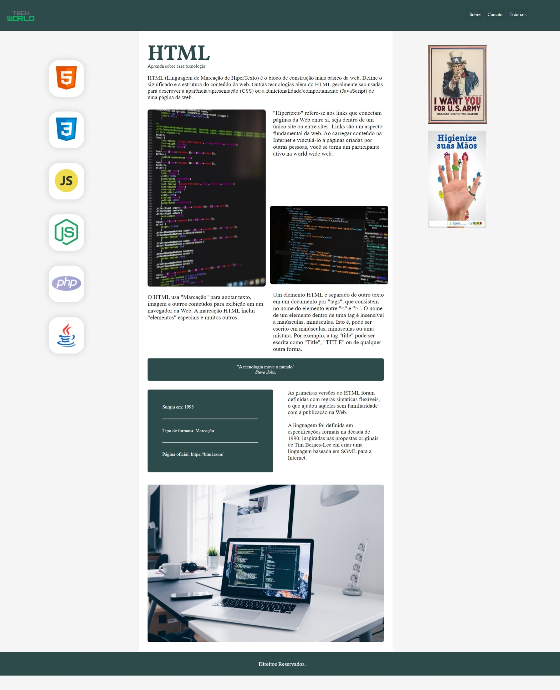

# EXERCÍCIO TECH WORLD 🌐
Tech World foi desenvolvido com o objetivo de fornecer uma fonte de aprendizado. Este projeto foi desenvolvido por mim no Academy One, utilizando apenas HTML e CSS.

Link para a visualização do site: [Tech World](https://emillysmoitinho.github.io/techworld/)

## Tecnologias Utilizadas
* HTML
* CSS

## Descrição do Projeto
O exercício proposto pelo Academy One consiste na criação do layout a seguir, seguindo as premissas
de design com HTML e CSS. O layout foi criado mesclando os displays GRID e FLEX, com maior
ênfase no grid.

